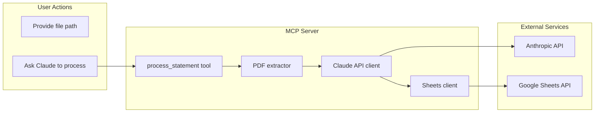

# Julius the AI Family Accountant

An MCP server that processes bank statement PDFs and appends extracted transactions to your family budget Google Sheet. Connect it to Claude Desktop and ask Claude to process statements for you

[](https://www.youtube.com/watch?v=APBFOKRrNKA)



## Prerequisites

- Node.js 18+
- [Claude Desktop](https://claude.ai/download)
- Bank statement PDFs (Wells Fargo format, filtered by date range recommended)

## Setup

### 1. Install and build

```bash
npm install
npm run build
```

### 2. Get an Anthropic API key

1. Go to [console.anthropic.com](https://console.anthropic.com)
2. Sign in or create an account
3. Navigate to **API Keys**
4. Create a new key and copy it
5. Create a `.env` file in this directory (copy from `.env.example`):
   ```
   ANTHROPIC_API_KEY=sk-ant-...
   ```

### 3. Google Cloud and OAuth

1. Go to [console.cloud.google.com](https://console.cloud.google.com)
2. Create a new project (e.g. "Julius Accountant")
3. Enable **Google Sheets API**: APIs and Services > Library > search "Google Sheets API" > Enable
4. Create OAuth credentials: APIs and Services > Credentials > Create Credentials > **OAuth client ID**
5. If prompted, configure the OAuth consent screen first (External, add your email as a test user)
6. Application type: **Desktop app**
7. Name it (e.g. "Julius MCP") and Create
8. Copy the Client ID and Client Secret
9. Add to `.env`: `GOOGLE_CLIENT_ID=...`, `GOOGLE_CLIENT_SECRET=...`
10. **Important:** Add the redirect URI for the auth script. Edit your OAuth client > under "Authorized redirect URIs" add: `http://localhost:3000/oauth2callback` (you may need to change application type to "Web application" to add this, or use a Desktop app and ensure localhost redirects are allowed)
11. Get your Spreadsheet ID: open your budget sheet, copy the ID from the URL `https://docs.google.com/spreadsheets/d/SPREADSHEET_ID/edit`
12. Add to `.env`: `SPREADSHEET_ID=...`

### 4. First-time OAuth (get token.json)

```bash
npm run auth
```

A browser will open. Sign in with Google and grant access. The tokens will be saved to `token.json` (gitignored).

### 5. Add Julius to Claude Desktop

1. Open Claude Desktop > Settings > Developer > **Edit Config**
2. Or edit the config file directly:
   - macOS: `~/Library/Application Support/Claude/claude_desktop_config.json`
   - Windows: `%APPDATA%\Claude\claude_desktop_config.json`
3. Add Julius to `mcpServers`:

```json
{
  "mcpServers": {
    "julius": {
      "command": "node",
      "args": [
        "/absolute/path/to/julius-the-stingy-family-accountant/build/index.js"
      ],
      "env": {
        "ANTHROPIC_API_KEY": "your-key",
        "SPREADSHEET_ID": "your-spreadsheet-id",
        "GOOGLE_CLIENT_ID": "your-client-id",
        "GOOGLE_CLIENT_SECRET": "your-client-secret"
      }
    }
  }
}
```

Or use a script that loads `.env`; the MCP server reads from `process.env`, so ensure these variables are set when Claude runs the server.

4. **Restart Claude Desktop** completely (quit and reopen)

### 5b. Or use Cursor instead

Julius works with Cursor IDE too. A project-scoped config is in `.cursor/mcp.json` (gitignored). Open this project in Cursor—the MCP server will connect automatically. In Cursor chat, ask to process a statement (e.g. "Use the Julius tool to process /path/to/statement.pdf"). Restart Cursor after config changes.

## Usage

Upload the bank statement to a directory on your computer and give Claude the path. Tell it to:

> Process the bank statement at /path/to/statement.pdf

Claude will call the `process_statement` tool with the upload path. Transactions are extracted and appended to the current month's tab in your Google Sheet (e.g. "February 2026").

Ensure your spreadsheet has a tab matching the current month.

## Spreadsheet layout

- **Tabs:** Month and year (e.g. "November 2024", "February 2026")
- **Columns:** Date | Category | Description | Amount
- Categories must match the dropdown list exactly (or leave blank for Claude to fill in later)

## Re-auth

If your Google token expires, run:

```bash
npm run auth
```

and re-authorize in the browser.

## Troubleshooting

- **"token.json not found"**: Run `npm run auth`
- **Redirect URI mismatch**: Add `http://localhost:3000/oauth2callback` to your OAuth client's authorized redirect URIs in Google Cloud Console
- **"File not found"**: If you uploaded the PDF, Claude passes a path like `/mnt/user-data/uploads/[filename]`; if that path isn't accessible to the MCP process, try saving the PDF locally and use its path instead (e.g. `Process the bank statement at /Users/you/Desktop/statement.pdf`)

Might need to purchase Anthropic API credits as well.
